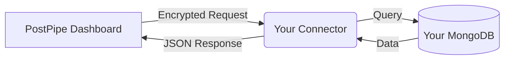

> [!NOTE] > **Developer Deep Dive**  
> This page explains the technical philosophy behind PostPipe's "Static" and "Dynamic" components.

## The Hybrid Model

PostPipe is not just a UI library or a backend-as-a-service. It is a **Hybrid Development Platform** that bridges the gap between:

1.  **Static Data Sources** (Your existing databases)
2.  **Dynamic Applications** (New Full-stack apps you build)

---

## Part 1: The Static Connector (The "Tunnel")

The **Static Connector** is for developers who _already have a database_ and just want a way to interact with it securely from a modern frontend or dashboard, without building a custom API.

### How it works visually



### The Technical Flow

1.  **No Direct Access**: PostPipe servers **never** touch your database directly. We don't want your IP whitelisting.
2.  **The Connector**: You run a lightweight Node.js server (the "Connector") on your own infrastructure (Vercel, Railway, EC2).
3.  **The Tunnel**: This connector listens for cryptographically signed requests from PostPipe, executes the query on _your_ local network/VPC, and returns the result.
4.  **Security**: Every request is verified using SHA-256 HMAC signatures (`X-PostPipe-Signature`).
5.  **Smart Resolution**: The connector automatically detects if a request is for **MongoDB** or **PostgreSQL** based on the form configuration or naming conventions.
6.  **Cross-Database Routing**: Using target database IDs (e.g., `marketing`), the connector can route data to different physical databases by mapping to environment variable suffixes (e.g., `MONGODB_URI_MARKETING`).

**Why use this?**

- Zero Vendor Lock-in (It's just your DB).
- Data Sovereignty (Data never leaves your control except to be displayed).
- "Instant API" for legacy databases.

---

## Part 2: The Dynamic CLI (The "Factory")

The **Dynamic Ecosystem** is for building _new_ applications from scratch. Instead of piecing together Auth, ORM, and CSS frameworks, you use our CLI.

### The Command

```bash
npx create-postpipe-app my-startup
```

### What happens under the hood?

1.  **Scaffolding**: The CLI pulls a "Golden Template" based on your choices (Next.js, Tailwind, MongoDB/Postgres).
2.  **Pre-Configuration**: It pre-configures Authentication (Auth.js), Database Connections, and API Routes.
3.  **Components**: It installs the core "Dynamic Components" (e.g., `<UserProfile />`, `<PaymentForm />`) that are _ready to use_.

**Why use this?**

- **Speed**: Save 2-3 weeks of setup time.
- **Consistency**: All your projects share a robust, proven architecture.
- **Ownership**: You own the code. It's not a "No-Code" tool that traps you; it's a "Pro-Code" tool that starts you at 80% completion.

---

## Summary

| Feature        | Static Connector          | Dynamic CLI           |
| :------------- | :------------------------ | :-------------------- |
| **Best For**   | Existing Databases        | New Projects          |
| **Deployment** | You deploy a small server | You deploy a full app |
| **Data Flow**  | Tunneling (Proxy)         | Direct App-to-DB      |
| **DB Support** | Mongo / Postgres / Neon   | Framework-dependent   |
| **Philosophy** | "Connect to what exists"  | "Build what's next"   |
